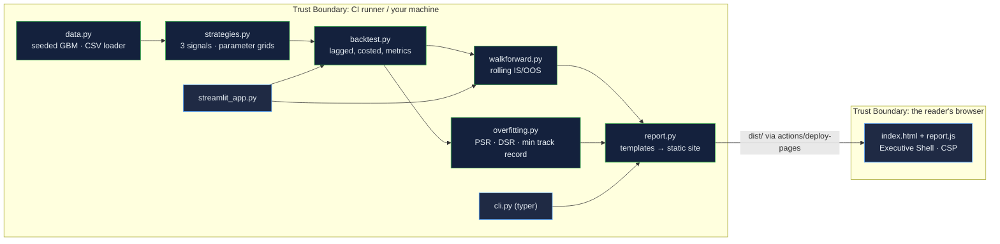

# Algo Trading Research Kit: a backtester whose job is to tell you the strategy does not work

[](https://github.com/Freddricklogan/algo-trading-research-kit/actions/workflows/deploy.yml)
[](#5-getting-started--verification)
[](https://github.com/Freddricklogan/algo-trading-research-kit/actions/workflows/codeql.yml)
[](LICENSE)
[](https://freddricklogan.github.io/algo-trading-research-kit/)

## 1. Executive Summary & Business Impact

**Problem statement.** Most backtests are optimistic three times over: they
ignore transaction costs, they choose parameters on the same data they
report, and they show the best of many attempts as if it were the only one.
The result is a Sharpe ratio that evaporates the day real money is
committed. The tools to prevent this — costed simulation, walk-forward
validation, deflation for multiple testing — are well documented and rarely
applied together.

**Solution & value delivered.** A small, typed Python package that applies
all three, and a report that shows the gap. Three strategies (moving-average
crossover, momentum, mean reversion) are backtested on a seeded synthetic
series with a one-day signal lag and per-turnover costs; parameters are
chosen on rolling training windows and traded only out of sample; and the
best-of-grid Sharpe is deflated for the number of parameter sets tried, after
Bailey and López de Prado. CI runs the whole thing and publishes the report
to Pages, so every number on the live page was computed by the run that
published it. On the shipped seed, none of the three strategies survives
deflation — which is the correct answer on a random walk, and the point.

**[→ Read the full case study](docs/CASE_STUDY.md)**

| Outcome | How this repo delivers it |
| --- | --- |
| No look-ahead | The signal on day t is traded at day t+1's close; a test with a "perfect" signal proves the lag |
| Costs that bite | Commission + slippage in basis points on every unit of turnover; the report draws the no-cost curve beside the real one |
| The honest record | `walk_forward()` chooses parameters in-sample and concatenates only out-of-sample days |
| A number for "how many tries?" | `deflated_sharpe()` benchmarks the best-of-grid Sharpe against the expected maximum of N trials, with a verdict |
| Reproducible by anyone | `algo-research report --seed 42` regenerates the live page byte-for-byte; a Streamlit app takes your own CSV |

## 2. Demonstrated Competencies & Technical Skills

- **Systems Architecture & CS** — `src/` layout, `pyproject.toml`, `uv`;
  `mypy --strict` over the package and tests; pure functions over NumPy
  arrays; a report generator that emits a CSP-safe static site from string
  templates.
- **Data Science & AI** — vectorised backtesting, walk-forward validation,
  probabilistic and deflated Sharpe ratios with the skew and kurtosis terms,
  minimum track-record length; every formula tested against a closed form or
  hand arithmetic.
- **Cybersecurity & Compliance** — `bandit`, `pip-audit`, Trivy and CodeQL
  (Python and JavaScript) in CI; the report page ships with
  `default-src 'none'` and no inline script; the CSV loader validates every
  row.
- **EdTech & Human-Centered Design** — built from the Oxford Saïd programme
  on algorithmic trading as a teaching instrument: the report's tour walks
  from the flattering in-sample chart to the deflated verdict, and the method
  is written on the page.

## 3. System Architecture & Data Flow



## 4. Technical Highlights & Engineering Decisions

### ADR-1 — Lag the signal inside the backtester, not in each strategy

**Context.** Look-ahead bias is the commonest backtesting error and the
easiest to introduce accidentally in a strategy function.

**Decision.** Strategies return the target position from data up to day t;
`run_backtest()` holds it during day t+1. A test feeds a signal that
"knows" tomorrow and asserts the returns it would have earned without the
lag are not earned.

**Consequence.** No strategy can look ahead by construction, and the
convention is stated once, in the module docstring, rather than repeated.

### ADR-2 — Deflate the in-sample Sharpe for the size of the grid

**Context.** Choosing the best of 22 parameter sets on the whole series
produces a good-looking Sharpe by construction.

**Decision.** `deflated_sharpe()` computes the expected maximum Sharpe
among N trials with the observed cross-trial variance and reports the
probability the chosen strategy beats it, with the skew and kurtosis
adjustment from the reference paper. The report shows the verdict beside
the in-sample chart.

**Consequence.** On the shipped seed the highest in-sample Sharpe
(mean reversion, 0.72) has an out-of-sample Sharpe of −0.09 and a DSR of
0.49 — the report says so rather than hiding it.

### ADR-3 — Generate the Pages site from templates in the package

**Context.** A Streamlit app needs a host; a notebook needs a reader. The
portfolio standard wants a URL that returns 200 with the Executive Shell.

**Decision.** `report.py` renders `string.Template` files with computed
values, copies the shell assets, and CI deploys the directory. The embedded
JSON drives the shell's KPI strip; no server, no inline script.

**Consequence.** The live page is a build artefact of the tested code, and
the same command reproduces it locally.

## 5. Getting Started & Verification

**Prerequisites.** Python 3.12, [`uv`](https://docs.astral.sh/uv/).

```bash
git clone https://github.com/Freddricklogan/algo-trading-research-kit.git
cd algo-trading-research-kit
uv venv && uv pip install -e ".[dev,app]"
make check                              # lint → typecheck → test → security → build
uv run algo-research report --out dist  # the static report
uv run streamlit run streamlit_app.py   # the interactive app
```

**Verification — the numbers this repository actually produced:**

```bash
uv run pytest --cov      # 24 passed · TOTAL 99% (statements + branches)
uv run ruff check .      # All checks passed
uv run ruff format --check .
uv run mypy              # Success: no issues found in 14 source files
uv run bandit -q -r src  # Low 0 · Medium 0 · High 0
uv run pip-audit --skip-editable  # No known vulnerabilities found
```

| Check | Result |
| --- | --- |
| Unit tests | **24 passed / 24** across 6 files |
| Coverage | **99%** (statements + branches) |
| ruff, ruff format, `mypy --strict` | clean, 14 source files |
| bandit / pip-audit | 0 findings / no known vulnerabilities |
| Report (seed 42, 1,500 days, 22 parameter sets) | ma_crossover IS Sharpe 0.08 → OOS −0.13, DSR 0.242 · momentum 0.37 → 0.46, DSR 0.440 · mean_reversion 0.72 → −0.09, DSR 0.488 |
| Headless Chrome smoke (built report) | **0 console errors**; shell KPIs from embedded JSON; no-cost overlay toggles 3 curves; five tour steps; no horizontal scroll at 1280 |

## 6. Live Demo & Production Showcase

**<https://freddricklogan.github.io/algo-trading-research-kit/>** — the
report CI generated from the package on seed 42.

**30-second guided walkthrough.** Press **Take the 30-second tour**.

1. **What this page is** — a CI build artefact, reproducible by one command.
2. **In-sample looks good; that is the problem** — best-of-grid, with and
   without costs.
3. **Walk-forward is the honest record** — only out-of-sample days.
4. **Deflate for the number of tries** — the lowest DSR on this run.
5. **Method, stated** — lag, costs, folds, reference, annualisation.

For your own data: `uv run streamlit run streamlit_app.py` and upload a CSV
with `date` and `close`. The Streamlit app is not hosted; it runs locally.
